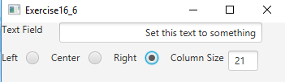

# Project Title
Exercise 16_6 Demonstrate Text Field Properties

## Example Output

## Analysis Steps

In Exercise 16_6, the main goal of this assignment was to figure out how to make the layout. Writing the eventhandlers wasn't too hard it was more of coming out with the 2 by 4 design with labels.

### Design

I approached the layout by making multiple HBox's for the top section and bottom section. The top was easy because it was just a HBox for a label and a textfield. The bottom took a bit more thought process, I made a HBox for the radio buttons themselves with labels, then a seperate HBox for the column setting textbox. Finally, I put the top and bottom Hbox's parents into a VBox so they would be right next to each other whenever I set the positioning of them from the parent BorderPane.

// Top
HBox top = new HBox(20);
TextField midText = new TextField();
top.getChildren().add(new Label("Text Field"), midText;

// Bottom

HBox bottom = new HBox(10);
HBox buttons = new HBox(10);
HBox colSets = new HBox(5);
RadioButton center = new RadioButton();
RadioButton left = new RadioButton();
RadioButton right = new RadioButton();
TextField brText = new TextField();
// Creation of children to be put in the parent HBox "bottom"
buttons.getChildren().addAll(new Label("Left"),left,new Label("Center"),center,new Label("Right"),right);
colSets.getChildren().addAll(new Label("Column Size"), brText);
bottom.getChildren.addAll(buttons,colSets);

// Then add them into a container VBox
VBox v = new VBox(10);
v.getChildren().addAll(top, bottom);

// Finally add VBox into a BorderPane
root.setCenter(v);

### Testing

The only real issue I ran into while testing was not being able to properly center the VBox, it would always center it at the top and not vertically center it. I resulted into reducing the height of the Scene to make it look more centered.

## Adapted from a README Built With

* [Dropwizard](http://www.dropwizard.io/1.0.2/docs/) - The web framework used
* [Maven](https://maven.apache.org/) - Dependency Management
* [ROME](https://rometools.github.io/rome/) - Used to generate RSS Feeds

## Contributing

Please read [CONTRIBUTING.md](https://gist.github.com/PurpleBooth/b24679402957c63ec426) for details on our code of conduct, and the process for submitting pull requests to us.

## Versioning

We use [SemVer](http://semver.org/) for versioning. For the versions available, see the [tags on this repository](https://github.com/your/project/tags). 

## Authors

* **Billie Thompson** - *Initial work* - [PurpleBooth](https://github.com/PurpleBooth)

See also the list of [contributors](https://github.com/your/project/contributors) who participated in this project.

## License

This project is licensed under the MIT License - see the [LICENSE.md](LICENSE.md) file for details

## Acknowledgments

* Hat tip to anyone who's code was used
* Inspiration
* etc
