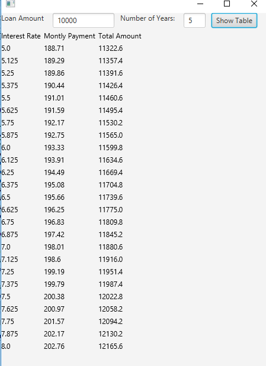

# Project Title

Exercise 16_13 Compare Loans with Various Interest Rates

## Example Output

## Analysis Steps

In Exercise16_13, the point of the assignment was to rewrite a older assignment(Exercise 2.16) in a GUI application.

### Design

I just had to think of a way to convert the Scanner input into textfields in this particular assignment. The calculations were done for me so my focus was mainly on the design of the textfields, labels, and the table. 

For each textfield/label I created a HBox and to connect the two textfields and the button I used a parent HBox to control the spacing.
e.g.
// Creating each individually
TextField loan = new TextField();
HBox loanBox = new HBox(new Label("Loan Amount"), loan);
TextField years = new TextField();
HBox yearBox = new HBox(new Label("Number of Years:"), years);
Button tableShow = new Button("Show Table");

// Parent to keep them aligned
HBox entryHolder = new HBox(10);
entryHolder.getChildren().addAll(loanBox, yearBox, tableShow);

The creation of the table was through a for loop. I knew the interest rate was by default starting at 5% to 8% through increments of .125. I did:

for(double i = 5; i < 8; i+=.125)
with i being the interest rate.

This for loop also sets the amount of items that will be in each column. In other words, I created a next Text object for each iteration.

e.g. ( still inside teh for loop )

Text interestRate = new Text();
interestBox.getChildren().add(interestRate);

And for the title of each column, I added a text right before the for loop to interestBox which is a VBox to keep each row looking table like.

### Testing

The testing portion for me was realzing that I needed to display the table after clicking the Show Table button. I solved this by setting a action of the Show Table button and inserting the for loop above within that handler. If it isn't inside of the handler, a error occurs because the textfields of loan and years aren't set to anything intially. That's why the show table button is needed so you can set the fields of loan and years to allow for the program to do it's calculations.

## Adapted from a README Built With

* [Dropwizard](http://www.dropwizard.io/1.0.2/docs/) - The web framework used
* [Maven](https://maven.apache.org/) - Dependency Management
* [ROME](https://rometools.github.io/rome/) - Used to generate RSS Feeds

## Contributing

Please read [CONTRIBUTING.md](https://gist.github.com/PurpleBooth/b24679402957c63ec426) for details on our code of conduct, and the process for submitting pull requests to us.

## Versioning

We use [SemVer](http://semver.org/) for versioning. For the versions available, see the [tags on this repository](https://github.com/your/project/tags). 

## Authors

* **Billie Thompson** - *Initial work* - [PurpleBooth](https://github.com/PurpleBooth)

See also the list of [contributors](https://github.com/your/project/contributors) who participated in this project.

## License

This project is licensed under the MIT License - see the [LICENSE.md](LICENSE.md) file for details

## Acknowledgments

* Hat tip to anyone who's code was used
* Inspiration
* etc
