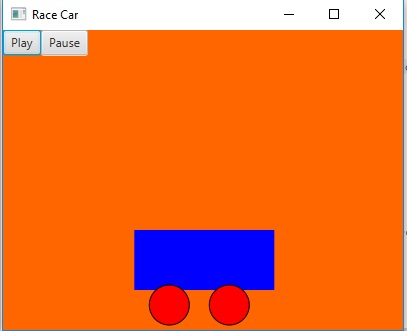

# Project Title

Exercise 15_29 Race Car

## Example Output

## Analysis Steps

I started out by figuring out how to get multiple shape objects move in the same direction at the same time. I knew making them move individually would ultimatelly lead to hard coding and potentially not fitting the DRY requirements.

### Design

I approaced the problem by creating three seperate objects, a rectangle for the body of the car, and two circles for the wheels. I used their constructors to position them to look like a car and be positioned on the bottom of the height of the parent pane. I then put all of these into a parent object BorderPane so when it comes to creating the animation it would move them all at the same time.

### Testing

The way I tested it is the simply think about how to get an object from one place to another horizontally. A Line shape was the first thing that came to mind and that lead me to using PathTransition to create my animation. I used the line's x constructors to move the car from the beginning of where it was originally at to the width of the pane.
e.g.
PathTransition move = new PathTransition(Duration.seconds(3), new Line(0, 0, root.getWidth(), 0), car);
The car being the 3 objects used to create and position the car.

## Notes

I tried to make them all move individually and it always seemed like one of the wheels moved to fast for the body of the car or too fast. I figured out a pace that worked but it was really tedious so I just rewrote it and thought putting them all in the same parent pane would be easier. It turned out to be true!

* [Dropwizard](http://www.dropwizard.io/1.0.2/docs/) - The web framework used
* [Maven](https://maven.apache.org/) - Dependency Management
* [ROME](https://rometools.github.io/rome/) - Used to generate RSS Feeds

## Contributing

Please read [CONTRIBUTING.md](https://gist.github.com/PurpleBooth/b24679402957c63ec426) for details on our code of conduct, and the process for submitting pull requests to us.

## Versioning

We use [SemVer](http://semver.org/) for versioning. For the versions available, see the [tags on this repository](https://github.com/your/project/tags). 

## Authors

* **Billie Thompson** - *Initial work* - [PurpleBooth](https://github.com/PurpleBooth)

See also the list of [contributors](https://github.com/your/project/contributors) who participated in this project.

## License

This project is licensed under the MIT License - see the [LICENSE.md](LICENSE.md) file for details

## Acknowledgments

* Hat tip to anyone who's code was used
* Inspiration
* etc
